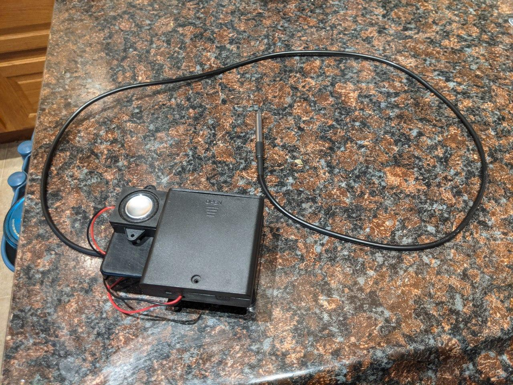
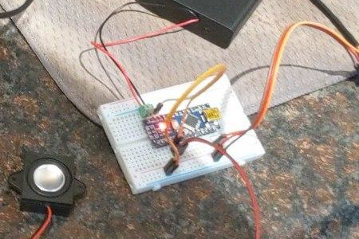

# Tea Whistle

A simple microcontroller project to make an annoying sound when water is boiling.

[Demo recording (YouTube)](https://youtu.be/FIj69jlRh0w)

## Motivation

My mother's tea kettle doesn't have a whistle, so she keeps getting distracted
and accidentally letting it boil over.
This sounds like a problem we can solve with a little bit of Rust and \$100 of
Amazon purchases.

## Hardware

Where included, links are to the exact products I used.

### Required

Bare minimum to replicate the project.

- Arduino Nano or Uno ([Amazon](https://smile.amazon.com/gp/product/B0713XK923))
- Speaker ([Amazon](https://smile.amazon.com/gp/product/B07FTB281F))
- DS18B20 waterproof temperature sensor([Amazon](https://smile.amazon.com/gp/product/B012C597T0))
- A single 4.7k Ohm resistor ([Amazon](https://smile.amazon.com/gp/product/B072BL2VX1))
- Mini USB cable if you don't already have one ([Amazon](https://smile.amazon.com/gp/product/B003L18SHC))

### Niceties

Not strictly required, but other things I used for assembling the unit.

- Breadboard ([Amazon](https://smile.amazon.com/gp/product/B07DL13RZH))
- Soldering Iron (I used the [PINECIL](https://pine64.com/product/pinecil-smart-mini-portable-soldering-iron), currently out of stock)
- Solder ([Amazon](https://smile.amazon.com/gp/product/B01N0VNNKO))
- Screw terminals ([Amazon](https://smile.amazon.com/gp/product/B07YK4QM9C))
- Jumper wires ([Amazon](https://smile.amazon.com/gp/product/B07GD2BWPY))
- Enclosure to hold assembled unit ([Amazon](https://smile.amazon.com/gp/product/B073Y7FW1Q))
- AA 6V battery pack ([Amazon](https://smile.amazon.com/gp/product/B07L9M6VZK))
- A round file to make some room for the cables to stick out of the enclosure
- Adhesive to stick the battery pack and speaker to the outside of the enclosure

## Physical assembly

In my excitement to assemble the unit I failed to take a decent photo, so here's a tiny cropped frame from a video recording.

1. Connect the speaker
	1. Red wire to a digital (D) pin of your choice (I used D2)
	2. Black wire to GND (on an Arduino, you'll want to use the one on the same side as the digital pins)
2. Connect the temperature sensor
	1. GND to GND (probably will be a black wire, same one used for the speaker)
	2. Data to digital pin of your choice (probably will be a yellow wire, I used D3)
	3. 4.7k Ohm resistor connecting 5V and the digital pin used above, connected between the pin and the sensor data wire
	4. VCC to 5V (probably a red wire; technically, as a [1-Wire](https://en.wikipedia.org/wiki/1-Wire) device this can be used in "parasite mode" [[Datasheet](https://datasheets.maximintegrated.com/en/ds/DS18B20.pdf)], but I wouldn't recommend it for this)
